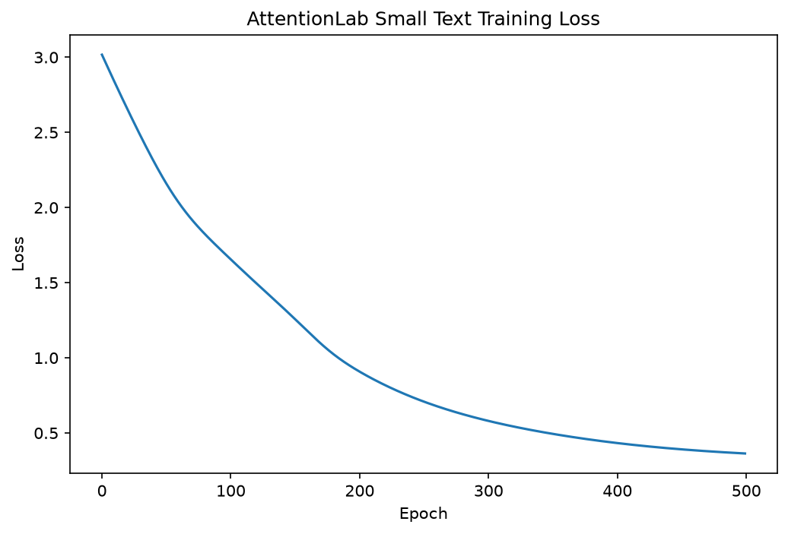

# Day 26 — AttentionLab

A minimal Transformer language model built from scratch in PyTorch, along with experiments using Hugging Face Transformers and Datasets.

This is part of my **70-Day AI Engineer Challenge**.

## Objective

Build and understand the core components behind a Transformer rather than only using a pretrained model.

### Topics covered

* Hugging Face Transformers
* Tokenizers and the Model Hub
* Hugging Face Datasets
* Token and positional embeddings
* Query, Key, Value projections
* Scaled dot-product attention
* Causal masking
* Multi-head self-attention
* Feed-forward networks
* Residual connections and LayerNorm
* Next-token prediction
* Training and loss curves

---

## AttentionLab Architecture

```text
Input Token IDs
      ↓
Token + Position Embeddings
      ↓
Multi-Head Self-Attention
      ↓
Residual + LayerNorm
      ↓
Feed-Forward Network
      ↓
Residual + LayerNorm
      ↓
Linear Language Model Head
      ↓
Token Logits
```

### Key tensor flow

For the main toy configuration:

```text
Input IDs          → [batch, sequence]
Embeddings         → [batch, sequence, embedding_dim]
Attention scores   → [batch, heads, sequence, sequence]
Attention output   → [batch, sequence, embedding_dim]
Logits             → [batch, sequence, vocab_size]
```

The implementation uses causal masking so each token can only attend to itself and previous tokens.

---

## Training Experiments

### 1. BERT Vocabulary Experiment

Used the `bert-base-uncased` vocabulary with **30,522 tokens** and a tiny randomly initialized Transformer.

The model started with a loss around:

```text
~10.4
```

and reached approximately:

```text
~9.3
```

with low token accuracy.

This demonstrated how difficult next-token prediction becomes when the output vocabulary is large and the model/data are extremely small.

### 2. Toy Vocabulary

A controlled vocabulary of only 8 tokens was used with a single training sequence.

Result:

```text
Final Loss:   ~0.50
Token Accuracy: 100%
```

The model was able to memorize the tiny sequence.

### 3. Small Text Corpus

The experiment used four short sentences:

```text
i enjoy eating shawarma
i enjoy drinking coffee
i like eating pizza
i like drinking tea
```

Result:

```text
Final Loss:    0.4002
Token Accuracy: 80%
```

The 80% result was particularly useful.

Some prefixes have multiple valid continuations:

```text
i     → enjoy / like
enjoy → eating / drinking
like  → eating / drinking
```

Because the model uses causal attention, it cannot look at future tokens to determine which continuation will appear later in the sentence.

This makes the 80% result an interesting demonstration of **conditional next-token prediction**, rather than simply a model failure.

---

## Hugging Face Exploration

Used:

* `pipeline()` for pretrained model inference
* `AutoTokenizer` and WordPiece tokenization
* Hugging Face Model Hub
* `Dataset` from the `datasets` library
* `Dataset.map()` for preprocessing
* Batched tokenization
* Padding and truncation
* `attention_mask`

Example preprocessing flow:

```text
Raw Text
   ↓
Hugging Face Dataset
   ↓
Tokenizer
   ↓
input_ids
attention_mask
token_type_ids
```

Also explored the difference between:

* padding masks
* causal attention masks

---

## Training Curve

The small-corpus training loss decreased consistently during training.



---
